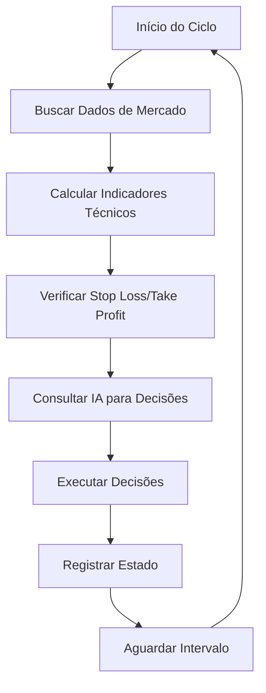

# Estratégia de Trading - Detalhamento Técnico

## Visão Geral

O bot de trading utiliza uma abordagem híbrida que combina **análise técnica clássica** com **inteligência artificial (Gemini)** para tomar decisões de entrada e saída de posições no mercado de criptomoedas.

---

## 1. Indicadores Técnicos

### 1.1 EMA20 (Exponential Moving Average - 20 períodos)
- **Propósito**: Identificar a tendência de curto prazo
- **Interpretação**:
  - Preço acima da EMA20 → Tendência de alta
  - Preço abaixo da EMA20 → Tendência de baixa
  - Cruzamento de preço com EMA20 → Possível reversão de tendência

### 1.2 RSI14 (Relative Strength Index - 14 períodos)
- **Propósito**: Medir momentum e identificar condições de sobrecompra/sobrevenda
- **Interpretação**:
  - RSI > 70 → Sobrecomprado (possível correção)
  - RSI < 30 → Sobrevendido (possível recuperação)
  - RSI entre 40-60 → Neutro

### 1.3 MACD (Moving Average Convergence Divergence)
- **Parâmetros**: (12, 26, 9)
- **Componentes**:
  - MACD Line: EMA12 - EMA26
  - Signal Line: EMA9 do MACD
  - Histogram: MACD - Signal
- **Interpretação**:
  - MACD cruza acima da Signal → Sinal de compra
  - MACD cruza abaixo da Signal → Sinal de venda
  - Histograma positivo → Momentum de alta
  - Histograma negativo → Momentum de baixa

### 1.4 Funding Rate
- **Propósito**: Avaliar sentimento do mercado de futuros
- **Interpretação**:
  - Funding Rate positivo → Longs pagando shorts (mercado otimista)
  - Funding Rate negativo → Shorts pagando longs (mercado pessimista)
  - Funding Rate extremo → Possível reversão

---

## 2. Sistema de Decisão por IA

### 2.1 Modelo LLM (Gemini)
O bot utiliza o modelo Gemini da Google para processar todos os dados de mercado e tomar decisões contextualizadas.

**Entrada do Modelo**:
```json
{
  "current_time": "2025-11-29T13:00:00",
  "total_equity": 5824.87,
  "total_return": -41.75,
  "market_data": {
    "BTC": {
      "price": 96500.00,
      "ema20": 96200.00,
      "rsi": 58.5,
      "macd": 120.5,
      "macd_signal": 100.2,
      "funding_rate": 0.0001
    }
  },
  "positions": {
    "BTC": {
      "side": "long",
      "quantity": 0.05,
      "entry_price": 95000.00,
      "unrealized_pnl": 75.00
    }
  }
}
```

**Saída Esperada**:
```json
{
  "BTC": {
    "decision": "hold",
    "reasoning": "RSI neutro, MACD positivo, posição em lucro",
    "confidence": 0.75
  },
  "ETH": {
    "decision": "entry",
    "side": "long",
    "quantity": 2.0,
    "stop_loss": 3800.00,
    "profit_target": 4200.00,
    "leverage": 1.0,
    "reasoning": "RSI oversold, MACD bullish crossover",
    "confidence": 0.82
  }
}
```

### 2.2 Tipos de Decisão
- **entry**: Abrir nova posição (long ou short)
- **close**: Fechar posição existente
- **hold**: Manter posição ou aguardar

---

## 3. Gestão de Risco

### 3.1 Stop Loss
- **Padrão**: 5% abaixo do preço de entrada (long) ou acima (short)
- **Verificação**: Automática a cada iteração
- **Execução**: Imediata ao atingir o limite

### 3.2 Take Profit
- **Padrão**: 5% acima do preço de entrada (long) ou abaixo (short)
- **Verificação**: Automática a cada iteração
- **Execução**: Imediata ao atingir o objetivo

### 3.3 Sizing de Posição
- **Risco por Trade**: 2% do capital total (configurável)
- **Cálculo da Quantidade**:
```python
risk_amount = total_equity * (risk_per_trade / 100)
quantity = risk_amount / (entry_price * stop_loss_pct / 100)
```

### 3.4 Alavancagem
- **Padrão**: 1x (sem alavancagem)
- **Máximo**: 10x (configurável)
- **Margem Requerida**: `(quantity * price) / leverage`

### 3.5 Limites
- **Máximo de Posições Simultâneas**: 3 (configurável)
- **Exposição Máxima**: Controlada pelo sistema de sizing

---

## 4. Fluxo de Execução

### 4.1 Ciclo de Trading (Loop Principal)



### 4.2 Detalhamento do Ciclo

**1. Buscar Dados de Mercado** (30-60s)
- Fetch candles históricos (200 períodos)
- Obter preço atual via ticker
- Consultar funding rate

**2. Calcular Indicadores** (< 1s)
- Aplicar fórmulas de EMA, RSI, MACD
- Atualizar valores em tempo real

**3. Verificar Stop Loss/Take Profit** (< 1s)
- Iterar sobre todas as posições abertas
- Comparar preço atual com limites
- Executar fechamento se necessário

**4. Consultar IA** (5-15s)
- Montar prompt com todos os dados
- Enviar para API do Gemini
- Processar resposta JSON

**5. Executar Decisões** (1-5s)
- Validar decisões da IA
- Executar orders (simulado ou real)
- Atualizar registro de posições

**6. Registrar Estado** (< 1s)
- Persistir em CSVs:
  - `portfolio_state.csv`: Equity total e retorno
  - `trade_history.csv`: Histórico de trades
  - `ai_decisions.csv`: Decisões da IA
  - `market_snapshots.csv`: Dados de mercado
  - `active_positions.csv`: Posições abertas

**7. Aguardar Intervalo** (180s padrão)
- Sleep até próximo ciclo

---

## 5. Configurações Disponíveis

| Parâmetro | Padrão | Descrição |
|-----------|--------|-----------|
| `symbols` | BTCUSDT, ETHUSDT, BNBUSDT | Pares de trading |
| `interval` | 3m | Timeframe dos candles |
| `check_interval` | 180s | Intervalo entre ciclos |
| `initial_balance` | $10,000 | Capital inicial |
| `testnet` | true | Usar testnet da Binance |
| `stop_loss_pct` | 5% | Percentual de stop loss |
| `take_profit_pct` | 5% | Percentual de take profit |
| `max_positions` | 3 | Máximo de posições simultâneas |
| `risk_per_trade` | 2% | Risco por operação |
| `leverage` | 1x | Alavancagem |
| `system_prompt` | "" | Prompt customizado para IA |

---

## 6. Taxas e Custos

### 6.1 Trading Fees
- **Maker Fee**: 0.02% (Binance)
- **Taker Fee**: 0.04% (Binance)
- **Implementação**: 0.0275% (média)

### 6.2 Funding Rate
- **Frequência**: A cada 8 horas
- **Impacto**: Custo/ganho em posições abertas overnight
- **Consideração**: Calculado mas não deduzido automaticamente

---

## 7. Modos de Operação

### 7.1 Testnet (Padrão)
- **Endpoint**: `https://testnet.binancefuture.com`
- **Capital**: Simulado (não real)
- **Propósito**: Testar estratégias sem risco

### 7.2 Produção
- **Endpoint**: `https://fapi.binance.com`
- **Capital**: Real (ATENÇÃO!)
- **Propósito**: Trading com dinheiro real
- **Ativação**: Alterar `testnet: false` nas configurações

---

## 8. Versionamento de Configurações

### 8.1 Sistema de Versões
- Cada alteração de configuração cria uma nova versão
- Versionamento automático e incremental
- Histórico limitado às últimas 50 versões

### 8.2 Restauração
- Possível restaurar qualquer versão anterior
- Mantém timestamp e configurações completas
- Útil para A/B testing de estratégias

### 8.3 Arquivos
- `data/bot_config.json`: Configuração atual
- `data/config_versions.json`: Histórico de versões

---

## 9. Melhorias Futuras Sugeridas

1. **Backtesting**: Testar estratégias com dados históricos
2. **Multi-timeframe Analysis**: Combinar análises de diferentes timeframes
3. **Volume Profile**: Adicionar análise de volume
4. **Sentiment Analysis**: Integrar análise de sentimento de redes sociais
5. **Portfolio Balancing**: Rebalanceamento automático entre ativos
6. **Risk Metrics**: Sharpe ratio, Sortino ratio, Max drawdown em tempo real
7. **Alert System**: Notificações por email/telegram
8. **Paper Trading Mode**: Modo simulação com dados reais

---

## 10. Riscos e Disclaimers

⚠️ **AVISO IMPORTANTE**:
- Trading de criptomoedas envolve alto risco
- Perdas podem exceder o capital investido (com alavancagem)
- Resultados passados não garantem resultados futuros
- IA pode tomar decisões sub-ótimas
- Bugs de software podem causar perdas
- Use SEMPRE testnet primeiro
- Nunca invista mais do que pode perder

---

## 11. Suporte e Documentação

- **Código Fonte**: `src/trading_bot.py`
- **API Backend**: `src/api.py`
- **Frontend**: `frontend/src/components/`
- **Dados**: `data/*.csv`
- **Logs**: Console output com logging

Para mais informações ou suporte, consulte a documentação inline no código-fonte.
